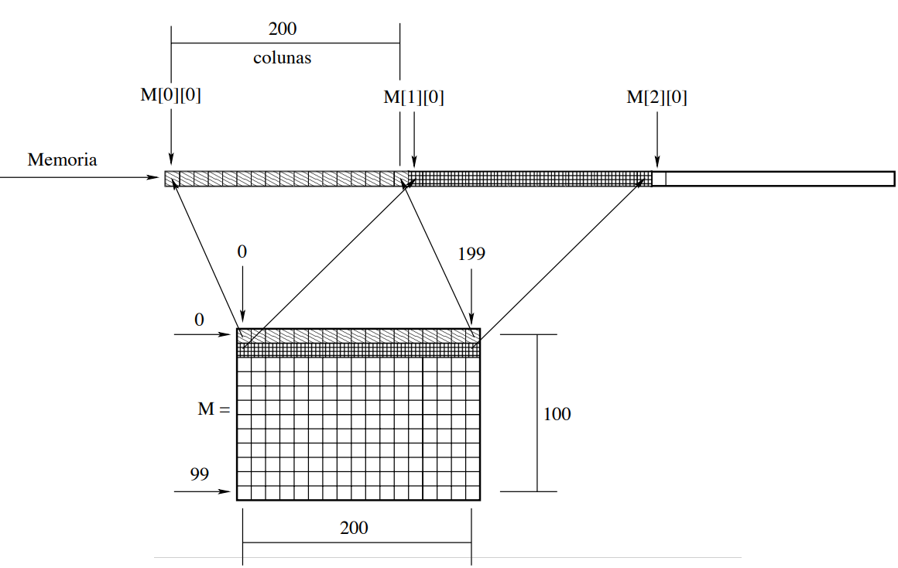

#  Ponteiros para matriz
  
  
  
###  Matriz m[100][200]
  
  
  

  
 Vamos supor que o endereçoo de M[0][0] é 10, ou seja, &M[0][0]→10. Assim, temos, &M[0][1]→11, &M[0][2]→12, ...,  Com isto, é possível saber o endereço de qualquer casa de M conhecendo-se o endereço de M[0][0]. Por exemplo, endereço de M[0][78] é &M[0][0] + 78 = 10 + 78 = 88. Refletindo um pouco vemos que para identificar o endereço de memória associado a um determinado elemento M[i][j], basta tomar &M[0][0] + i * númeroDeColunas + j.
  
Ex: m[12][18] = 10 + (12 ∗ 200 + 18)
  
###  Ponteiro para matriz
  
  
	int A [100][300] , i , j ; 
	int *p ;
	i = 3; j = 4;
	p = A[0];  // p = &A[0] [0] 
	p[ i * 300 + j ] = 4;  // M[i][j] = 4 
  